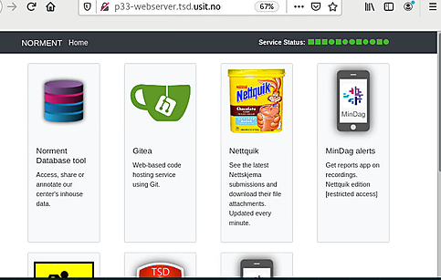
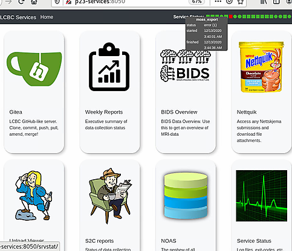
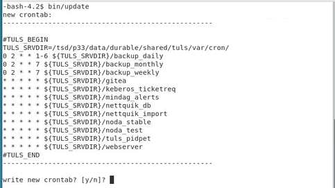

# TSD userland services

Setup services on a new TSD project in under 5 minutes. TULS:
  * runs services (by managing crontab) and keeps logs
  * includes 
    * a web server stack (Lighttpd, PostgreSQL, PHP)
    * a Github-like web service (Gitea)
    * a backup service (rsnapshot)
  * does not require root

  * [Quick start](#quick-start)
  * [Screenshots](#screenshots)
  * [Configuration](#configuration)
    * [Services](#services)
    * [Webserver](#webserver-lighttpd)
    * [Gitea](#gitea)
    * [Backup](#backup-rsnapshot)
  * [Requirements](#requirements)
  * [Folder structure](#folder-structure)
  * [Goals](#goals)
  * [For developers](#for-developers)

## Quick start

### outside TSD (with internet connection) 
  * Clone the repository and change into directory  
    `git clone ... && cd ...`
  * Download all files needed to build the services.  
    `make prepare_offline`
  * copy the whole directory into TSD

### inside TSD
  * `cd tuls...`
  * Build software and set up example services  
    `make example`  
  * Edit configs (ports, etc.). See below for specific details
  * Auto-start services (default: webserver, gitea, status monitoring)  
    `bin/update`
  * Go to `http://<HOST>:<PORT>` (default: http://localhost:8080)  
    
#### uninstall
  * Disable auto-start  
    `bin/disable`
  * Stop services  
    `bin/stop`

## Screenshots

  
Entry page of webserver customized for p33. 

---

  
Entry page of webserver customized for p23. 

---

  
Status page for services.

---

  
Management of crontab entries. The actual service definitions can be used version controls.

---

## Configuration

### Services

  * By default `./services` is a symlink to `example/services`. 
    Replace `./services` with a symlink to your custom folder 
    containg your own `*.service` files.
  * Run `bin/update` after configuring services.

#### Adding a new service  

  * Place a new file into `./services/`
  * A service program should:
    * run in foreground
    * write any log info stdout or stderr
    * exit with 0 on success
    * exit with != 0 on error
  * Run `bin/update`
  * Check the status with `bin/status` or the webpage

Note: Services can use the `TULS_BASEDIR` env variable.

### Webserver (lighttpd)

#### change port
  * Change the port (default 8080) defined in the `EXECSTART` entry of the webserver `.service` file (default `services/webserver.service`)

#### custom html and cgi files 
  * By default `./var/www` is a symlink to `example/www`. 
    Replace `./var/www` with a symlink to your custom folder.
  
### Gitea
  * Replace the symlink `opt/gitea/custom` to a directory containing your customized files.
  * Edit `opt/gitea/custom/conf/app.ini` to change gitea settings.

### Backup (rsnapshot)
  * edit `user.conf` and set `snapshot_root `and `backup` entries
  * make sure the directory `snapshot_root` already exists and is writable (mkdir ... if not)

## Folder structure
  * `./bin/` TULS bins
  * `./etc/` TULS config files
  * `./opt/` Optional apps; pre-packaged services
  * `./run/` Run-time variable data; invalid after each reboot
  * `./var/` Variable files; files that will change over time
  * `./var/exit/` Exit codes of services 
  * `./var/log/` Log files of services
  * `./var/www` Symlink to www folder hosted by webserver

## Requirements
  * bash
  * build tools (make, gcc, ...)
  * gettext (provides envsubst used opt/gitea/Makefile; could be bypassed)
  * rsync (backup)
  * zlib (git, lighttpd)

### prepare_offline
  * make
  * wget

## For developers

## Goals 
  * starting services (currently a wrapper for crontab - use systemd in the future?)
    * make sure no service runs more than once
    * version control of service configuration
    * write logs
  * include basic services (services that are likely to be relevant for any TSD project)
    * webserver
      * basic entry page 
      * monitoring of service status and logs
      * easy install of simple webapps (CGIs)
    * gitea
  * additional services - disabled by default
    * rsnapshot (+ webui?)
    * full web service stack (LLPP: Linux, Lighttpd, PostgreSQL, PHP)

### TODO
  * config: symlink config files to one folder (see tuls_cfg_p23 repo)
  * llpp: documentation, testing
  * add some webui for rnsapshot supporting config (?) and restore (minimal ftp server)?
  * busybox: use INSTALL_NO_USR config

